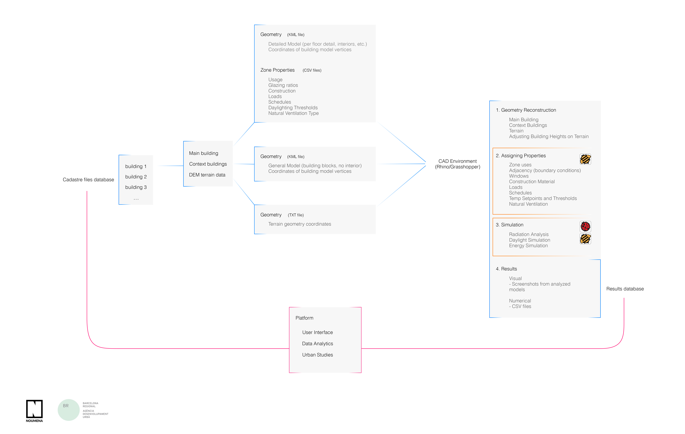
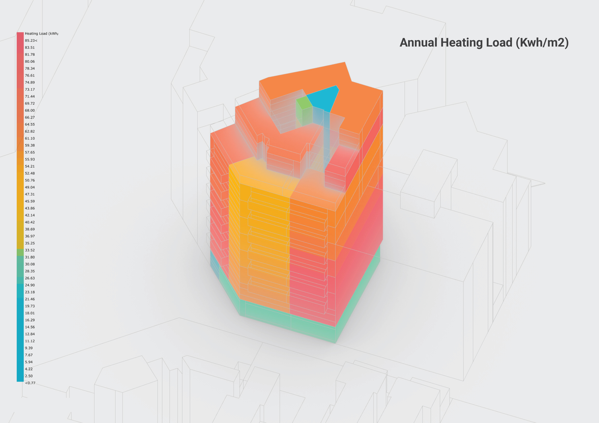
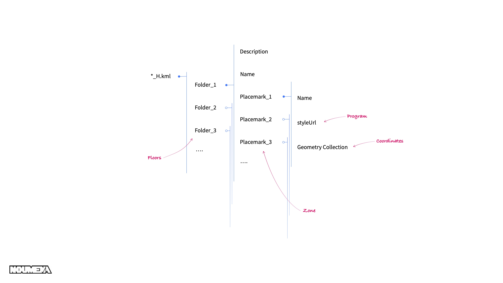
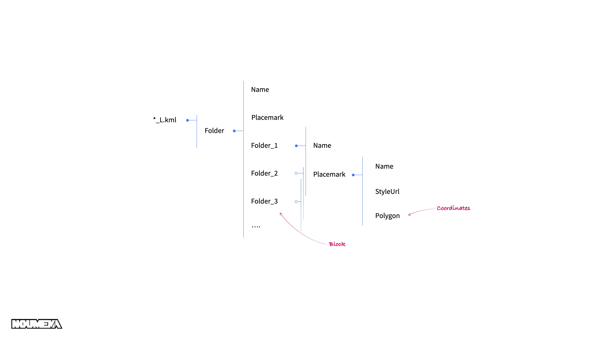
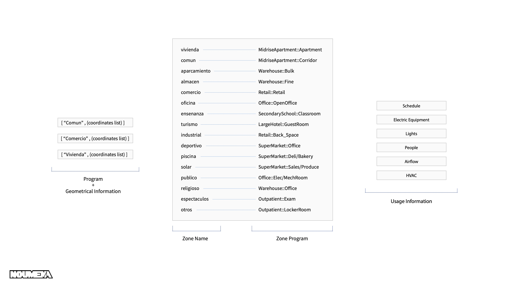
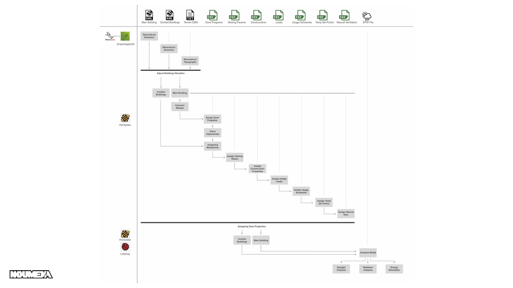

# Barcelona Energy

## Project Description

Development of a platform for energy analysis of buildings in Barcelona urban scale. 

1. Input data: Cadastre files for each building
2. Geometry reconstruction in grasshopper
3. Creation of Honeybee model in grasshopper
4. Radiation, Thermal and Daylight simulations in grasshopper
5. Data storage in csv, json and image formats
6. Storage of result in database (Mongodb)
7. Web-based data visualisation platform

***

# Part 1: Energy Simulation

## Requirements:

### Softwares
- [Rhinoceros 6 or later](https://www.rhino3d.com/)
- [Python 3.6 or later](https://www.python.org/downloads/)
- [Anaconda](https://www.anaconda.com/)
- [Radiance](https://github.com/LBNL-ETA/Radiance/releases)
- [OpenStudio](https://github.com/NREL/OpenStudio/releases)

###  Grasshopper Plugins
- [Ladybug Tools for grasshopper](https://www.food4rhino.com/en/app/ladybug-tools)
- [GH_CPython](https://www.food4rhino.com/en/app/ghcpython)
- [Meshedit](https://www.food4rhino.com/en/app/meshedit)
- [cameraControl](https://www.food4rhino.com/en/app/horster-camera-control-grasshopper)
- [Triceratops](https://www.food4rhino.com/en/app/triceratops)
- [Pancake](https://www.food4rhino.com/en/app/pancake)
- [WeaverBird](https://www.giuliopiacentino.com/weaverbird/)
- [Pufferfish](https://www.food4rhino.com/en/app/pufferfish)
- [Human](https://www.food4rhino.com/en/app/human)

***
## Installation:

- [Create an Anaconda virtual environment](https://docs.anaconda.com/anaconda/install/windows/)
- Install the following libraries inside the new enviornment:
    - regex  |  `pip install regex`
    - lxml  |  `pip install lxml`
    - pyproj |  `pip install pyproj==1.9.6`
    - vtk |  `pip install vtk`
    - glob | `pip install glob3`
- [Install Ladybug Tools](https://github.com/ladybug-tools/lbt-grasshopper/wiki/1.1-Windows-Installation-Steps)
- [Install other grasshopper plugins](https://parametricbydesign.com/grasshopper/tutorials/installing-grasshopper-and-plugins/)

***

## Usage:
By 29th of July 2021, the lastest version of files are in [this folder](https://drive.google.com/drive/folders/1J9j0oIT3NCSELpl7fSbbDkBUbCPpMzjk).

### Folder Structure:
- #kml_test_cases `(Dataset of different buildings)`
- 00#kml `(The gh code reads buildings information from this folder. Copy paste the content of any of the folders from test_cases inside this folder)`
- 00_EP-custom_library `(Contains the custom library for constructions and schedules. You will need to copy the .idf files to your computer)` `*Please follow the readme file inside this folder*`
- 00_meteo `(Weather information files)`
- 00_OpenStudio_measures 
- 01_executor `(Contains the grasshopper file to be executed)`
- 02#results_gh `(Contains the outputs of the simulations)`

### _H.kml file:
This file includes the data for main building in High resolution details. (including balconies, stair-case, interior walls, etc. and the properties of each building)

### _L.kml file:
This file includes the data for context building in Low resolution details. (outside geometry only - used to model the shading and adjacencies on main building)

### HB_.csv files:
These files contain the information related to H building. Different properties of each zone is stored in these files, such as usage program, thermal bridge parameter, apperture ratio, etc. These information would be inputs for HB model properties.

### Grasshopper Script:
This script reconstructs the geometries from H.kml and L.kml files. Then assigns programs, schedules, and other properties to the geometries to prepare the model for Honeybee and Ladybug analysis. Afterwards performs Thermal, Daylight and Radiation simulation and saves the results in different formats such as csv, json, image and 3d model.

Here is the activity diagram for the script:

***
## Reports and Notes:
You can find several presentations and notes on the process of the project in [this folder](https://drive.google.com/drive/folders/1W_WZUALN1KJawh8qrDOtGyWo35YGxFAQ):

- [2019 - May](https://drive.google.com/drive/folders/1i0nLwZ-XyMpy6VqS20rnYe2mUsai2n0L)
- [2019 - September](https://docs.google.com/document/d/1s0BkkXkYmjbdwFZp1dWC3KrE6cqCCbDNYwr4G7HgTcc/edit)
- [2020 - December](https://drive.google.com/drive/folders/1Yp6bYrcVhcqWTBaISY9ZcAKEtjkI1DsB)
- [2021 - July](https://drive.google.com/drive/folders/1nz9DJVmHWT8ME8vw4MWdMovLlZWR1ojt)

